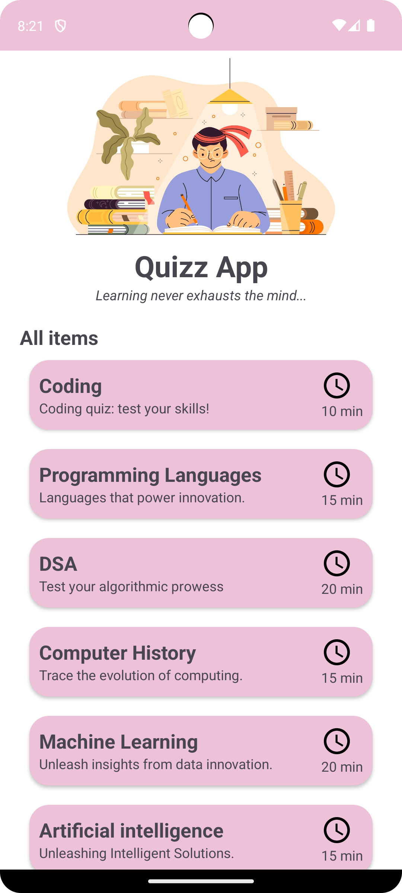
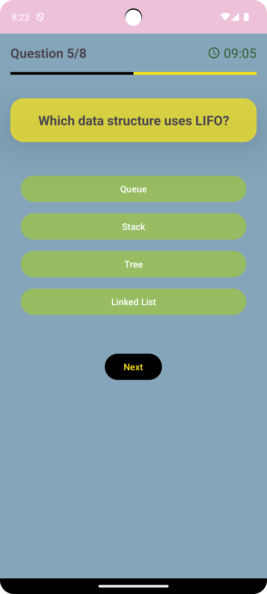
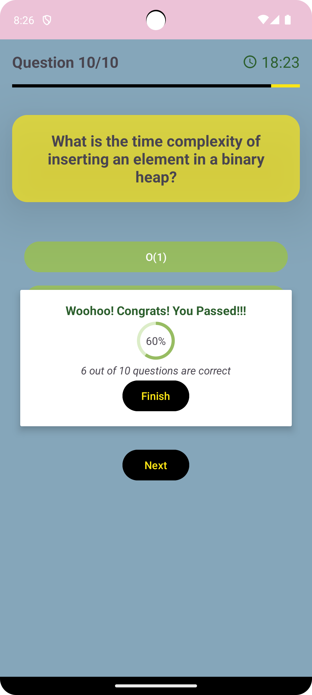

# Quiz Android App

## Overview
The Quiz Android App is designed to provide quizzes on various topics including Coding, Machine Learning, Programming, Databases, and more. Each quiz comes with a timer, and at the end, users can see their results along with a progress tracker.

## Features
- **Multiple Topics**: Quizzes on Coding, Machine Learning, Programming, Databases, etc.
- **Timed Quizzes**: Each quiz has a countdown timer.
- **Results**: Users receive their results at the end of each quiz.
- **Progress Tracker**: Tracks user progress across different quizzes.

## Tech Stack
- **Android Studio**: Development environment
- **Kotlin**: Programming language
- **Firebase Realtime Database**: Backend to store and fetch quizzes in JSON format

## Screenshots




## Installation
1. Clone the repository:
    ```bash
    git clone https://github.com/your-username/quiz-android-app.git
    ```
2. Open the project in Android Studio.
3. Connect your Firebase project:
    - Add your `google-services.json` file to the `app` directory.
4. Build and run the project on an Android device or emulator.

## Usage
1. Select a quiz topic.
2. Answer the questions within the time limit.
3. View your results and track your progress.

## Contributing
1. Fork the repository.
2. Create a new branch (`git checkout -b feature-branch`).
3. Make your changes.
4. Commit your changes (`git commit -am 'Add new feature'`).
5. Push to the branch (`git push origin feature-branch`).
6. Create a new Pull Request.

## License
This project is licensed under the MIT License. See the [LICENSE](LICENSE) file for details.

## Contact
For any queries or suggestions, feel free to reach out:
- **Name**: Mankesh Meena
- **Email**: dhanawatmankesh@gmail.com
- **GitHub**: mankesh-dhanawat(https://github.com/mankesh-dhanawat)
